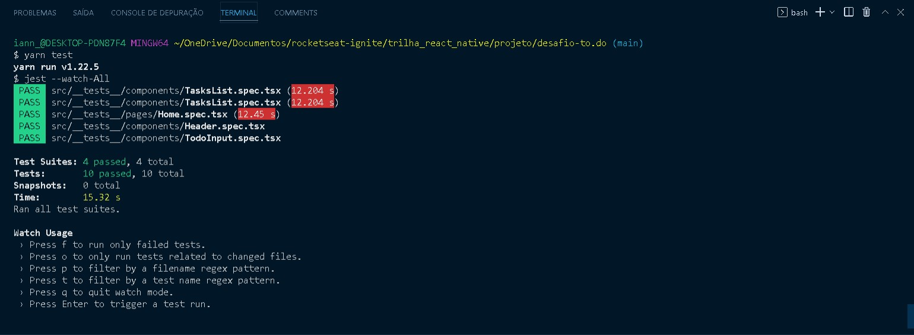
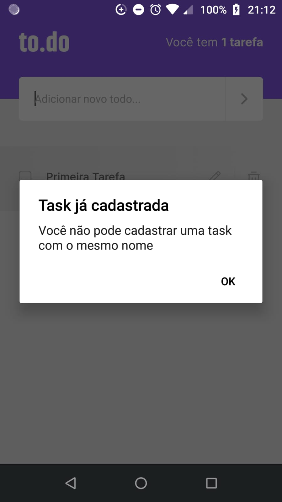
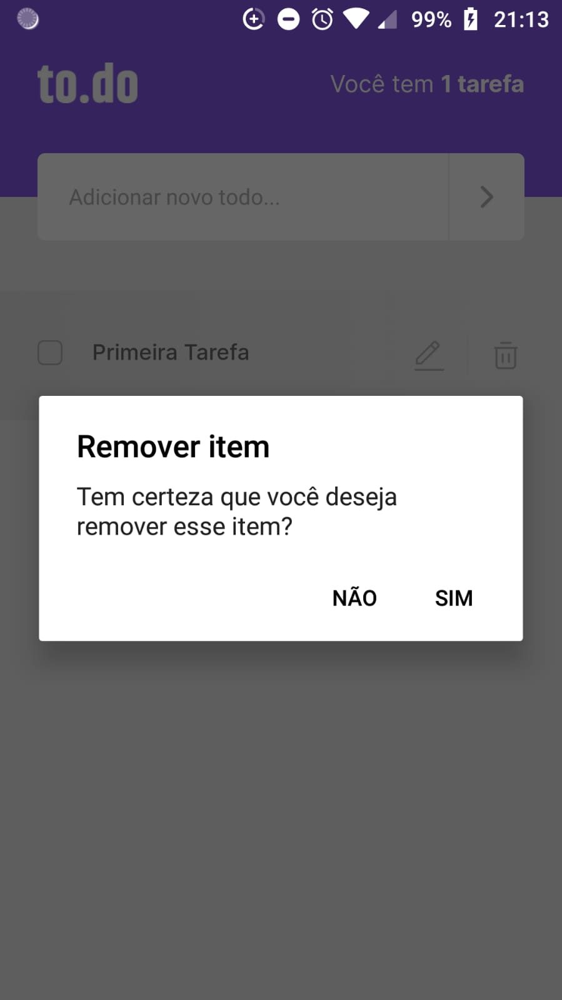

# Desafio: Conceitos do React Native
Nesse Desafio você irá aplicar tudo que aprendeu até agora no React Native enquanto constrói um App de tarefas.

## Primeiro desafio da trilha React Native - Ignite Rocketseat 2022

### :rocket: Sobre o desafio
Essa será uma aplicação de lembrete de tarefas, onde vai treinar um pouco mais sobre manipulação do estado no React.
As funcionalidades do aplicativo são:
  - Contagem de tarefas;
  - Adicionar uma nova tarefa;
  - Remover uma tarefa;
  - Marcar e desmarcar uma tarefa como concluída

### 📷  Screenshots

  
  
  
  

### 📷  Screenshot: Testes

  

### Desafio 02
Essa será uma continuação da aplicação de lembrete de tarefas desenvolvida no desafio anterior, onde você vai treinar um pouco mais sobre propriedades e componentização no React.
As funcionalidades do aplicativo são:
- Edição de uma tarefa;
- Exibir alerta pedindo confirmação ao remover uma tarefa;
- Exibir alerta ao tentar adicionar tarefa com o mesmo nome;

### 📷 Screenshots: Desafio 02

  
  
  

### Tecnologias
- React Native 0.64;
- TypeScript;

